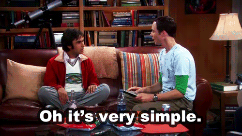

# Rock Paper Scissors Lizard Spock 🎮

<p align="center">
  
</p>

## 📋 Description

A Python implementation of the popular game "Rock Paper Scissors Lizard Spock," an expanded version of the classic Rock Paper Scissors game that was popularized by the TV show "The Big Bang Theory." This game reduces the chance of ties by introducing two additional options: Lizard and Spock.

Created by: Vaichalyy  
Last Updated: 2025-05-26

## 🎯 Game Rules

The game follows these winning rules:

- ✊ Rock crushes Scissors
- ✊ Rock crushes Lizard
- ✋ Paper covers Rock
- ✋ Paper disproves Spock
- ✌️ Scissors cut Paper
- ✌️ Scissors decapitate Lizard
- 🦎 Lizard poisons Spock
- 🦎 Lizard eats Paper
- 🖖 Spock smashes Scissors
- 🖖 Spock vaporizes Rock

As Sam Kass, the creator of this variation, explains: *"I invented this game (with Karen Bryla) because it seems like when you know someone well enough, 75-80% of any Rock Paper Scissors games you play with that person end up in a tie. Well, here is a slight variation that reduces that probability."*

## 🚀 Installation

1. Ensure you have Python 3.x installed on your system.
2. Download the `rock_paper_scissors_lizard_spock.py` file.
3. No additional libraries are required as this game uses only the standard `random` module.

## 🎮 How to Play

1. Run the script in your terminal/command prompt:
   ```
   python rock_paper_scissors_lizard_spock.py
   ```

2. When prompted, enter a number to make your choice:
   - 1 for Rock (✊)
   - 2 for Paper (✋)
   - 3 for Scissors (✌️)
   - 4 for Lizard (🦎)
   - 5 for Spock (🖖)
   - 6 to Quit

3. The computer will randomly choose its option.

4. The winner is determined based on the game rules.

5. After each round, you'll be asked if you want to play again.

## 📷 Screenshot

```
================================
Rock Paper Scissors Lizard Spock
================================
1) ✊
2) ✋
3) ✌️
4) 🦎
5) 🖖
6) Quit
Pick a number: 3

You chose: ✌️
CPU chose: ✌️
It's a tie!

Do you want to play again? (yes/no):
```

## ✨ Features

- User-friendly interface with emoji symbols
- Computer opponent with randomized choices
- Full implementation of the extended Rock Paper Scissors Lizard Spock rules
- Play multiple rounds without restarting the program
- Clear feedback on game outcomes

## 📚 Project Structure

- `rock_paper_scissors_lizard_spock.py`: Main game file containing all game logic

## 🛠️ Future Improvements

- Add a scoring system to track wins, losses, and ties
- Implement a graphical user interface
- Add sound effects for different game outcomes
- Create an AI opponent that learns from player choices
- Add multiplayer capability

## 📜 License

This project is licensed under the MIT License - see the [LICENSE](LICENSE) file for details.

## 🙏 Credits

- Original game variation by Sam Kass and Karen Bryla
- Popularized by the TV show "The Big Bang Theory"

---

*"Live long and prosper" 🖖*